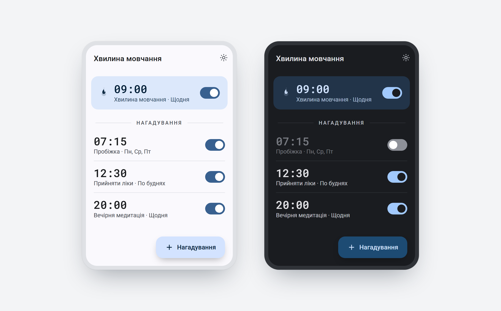

# Хвилина мовчання (xSilent)

Застосунок-нагадування вшанувати памʼять **хвилиною мовчання**. Щодня о 9:00
показує сповіщення й **проговорює текст уголос** (гонг → голос), а також
попереджає за 10 секунд до події та подає сигнал про її завершення. Поруч —
власні нагадування користувача з довільним часом, днями тижня та своїм текстом
озвучення.

Кросплатформний (Android / iOS), переписаний з нативної Android-версії
(Kotlin / Compose / Room / AlarmManager). Обґрунтування архітектурних рішень —
[DECISIONS.md](DECISIONS.md).



## Можливості

- **Вбудоване нагадування «Хвилина мовчання»** — щодня о 9:00, послідовність із
  трьох сповіщень: попередження (T−10 с) → оголошення з голосом (T) → сигнал
  завершення (T+1 хв).
- **Власні нагадування** — час, довільні дні тижня, окремий текст сповіщення,
  прапорець «Озвучити» та повзунок гучності озвучення.
- **Озвучення як звук каналу** — текст синтезується у файл при збереженні
  (`flutter_tts`), склеюється з гонгом і призначається звуком каналу сповіщення,
  тож систе­ма програє його **навіть коли пристрій заблокований**.
- Кнопки на банері: **«Гаразд»** і **«Відкласти»** (5 хв, для власних).
- Кнопка **«Прослухати»** в редакторі — попередній перегляд озвучення.
- Material 3, українська локаль, світла й темна теми.

## Стек

| Шар | Пакет |
|---|---|
| Сховище | `drift` (поверх SQLite) |
| Стан | `flutter_riverpod` |
| Сповіщення | `flutter_local_notifications` + `timezone` |
| Озвучення | `flutter_tts` (синтез у файл) + `audioplayers` (прев'ю) |
| Звук у сховищі | нативний `SoundStore` (MediaStore, Android) |

## Розробка

```bash
flutter pub get
dart run build_runner build          # генерує database.g.dart
flutter analyze
flutter test
flutter run                          # потрібен Android/iOS пристрій або емулятор
```

Після зміни таблиць у `lib/database/database.dart` перезапустити `build_runner`
(або тримати `dart run build_runner watch`).

## Структура

```
lib/
  main.dart                          bootstrap
  app.dart                           MaterialApp / тема / локаль (uk)
  providers.dart                     Riverpod-провайдери
  models/weekdays.dart               дні тижня як бітова маска
  utils/wav.dart                     склейка/розбір WAV (гонг + мовлення)
  database/database.dart             drift: таблиця Reminders, AppDatabase
  data/reminders_repository.dart     CRUD + синхронізація сповіщень
  services/
    notification_service.dart        канали, планування, кнопки банера
    announcement_service.dart        синтез озвучення → MediaStore
    sound_store.dart                 обгортка нативного MediaStore
    tts_service.dart                 налаштування рушія TTS
  widgets/candle_flame.dart          іконка-вогник (CustomPainter)
  screens/
    home_screen.dart                 список нагадувань
    edit_reminder_screen.dart        створення / редагування
    settings_screen.dart             налаштування
android/app/src/main/kotlin/…/SoundStore.kt   MediaStore через MethodChannel
```

## Платформи

- **Android** — дозволи та ресивери у `android/app/src/main/AndroidManifest.xml`;
  core library desugaring увімкнено (`android/app/build.gradle.kts`); озвучення
  через MediaStore-звук каналу.
- **iOS** — `UNUserNotificationCenter` delegate у `ios/Runner/AppDelegate.swift`;
  фонове озвучення через `Library/Sounds/` — окремий етап.
